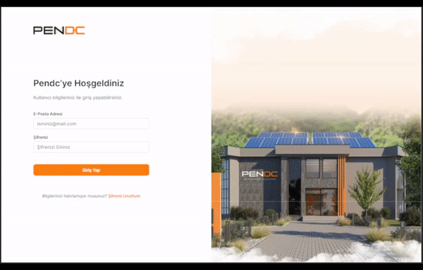
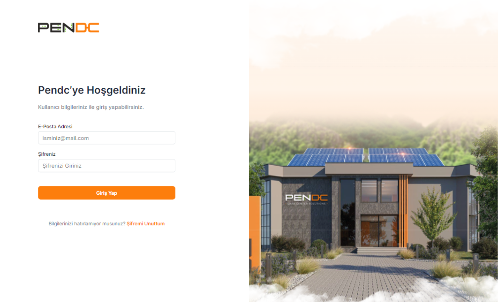
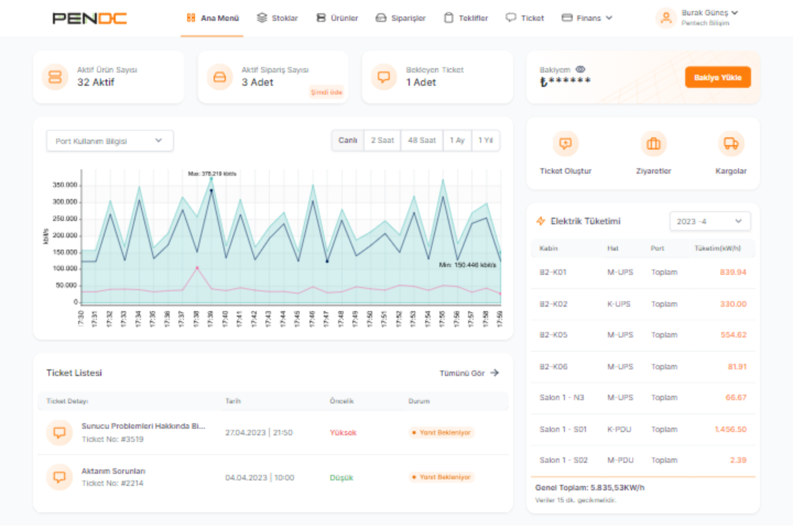
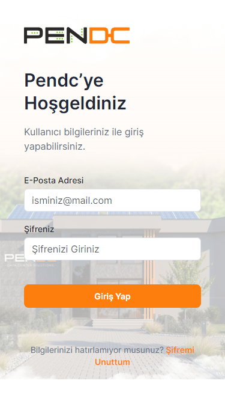

# [Pen DC ](https://pendc-task-six.vercel.app)

A web page task given by PenDC

## Screenshots

## Features

- Responsive design
- Pixel perfect design
- Navigation menu (dropdown, collapse)
- Direct to the dashboard page when clicking the sign in button
- Redirect to the login page from the user dropdown menu logout link

## Future Plans

- Data visualization
- Table data source integration
- User authentication

## Packages

- react
- react-dom
- react-router-dom
- react-icons
- bootstrap
